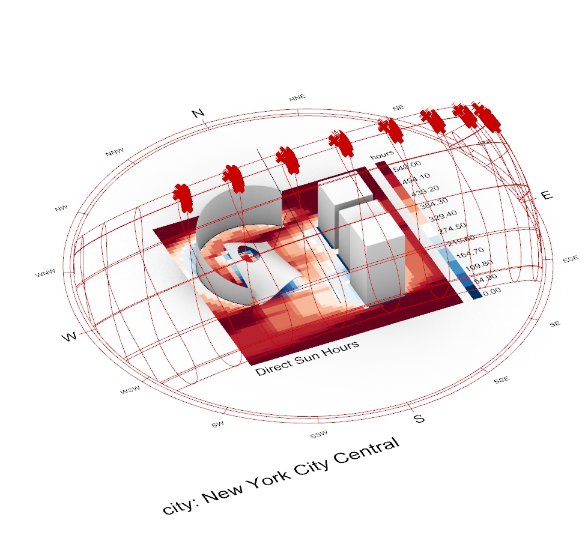
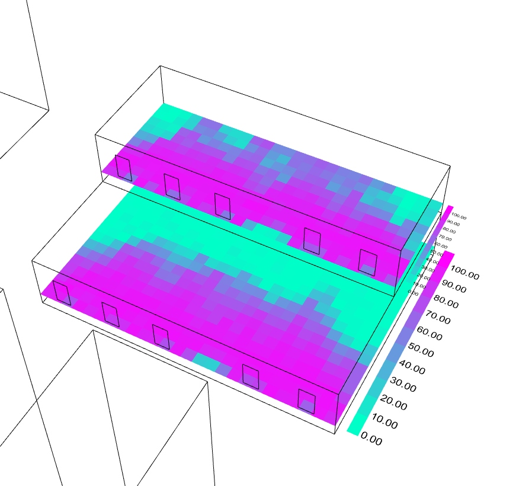

# Ladybug-Honeybee Daylight Analysis

Introduction to daylight simulation with the Ladybug and Honeybee tools for Grasshopper.

## Installation

Follow the instructions [here](https://github.com/ladybug-tools/lbt-grasshopper/wiki/1.1-Windows-Installation-Steps) to install the **Ladybug** plugin. Make sure to follow the instructions to install **Radiance** (the simulation engine for daylight). 

Note: you will need an account on [Food4Rhino](https://food4rhino.com/) to download Grasshopper add-ons. For general instructions to install Grasshopper plugins follow this [link](https://www.food4rhino.com/en/faq#users-install-grasshopper-plugin).

Finally, follow [these instructions](https://github.com/ladybug-tools/lbt-grasshopper/wiki/1.3-Verifying-Your-Installation) to check if the installation has been done correctly.

## Example Files

[Direct Sunlight Hours](examples/sunlight_hours/)
This file will cover a simple setup to run direct sunlight analysis with Ladybug. Topics include:
- Gather weather data and plot sun paths.
- Custom analysis periods.
- Result visualization and metric calculation.

[Annual Daylight simulations](examples/annual_daylight/)
This file will cover the following topics:
- Gather weather data and plot sun paths.
- Setup simple annual daylight simulation model.
- Visualize results with custom gradients.
- Introduction to daylight availability metrics including *daylight autonomy* (DA) and *useful daylight illuminance* (UDI).

